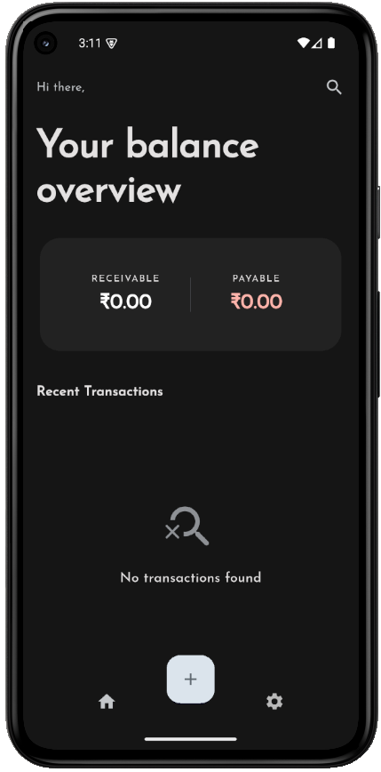
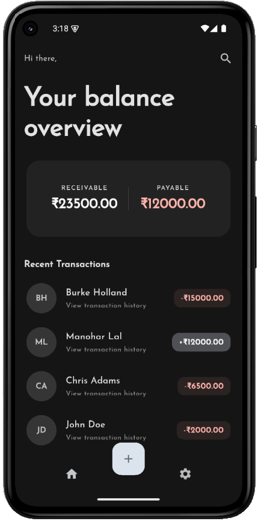
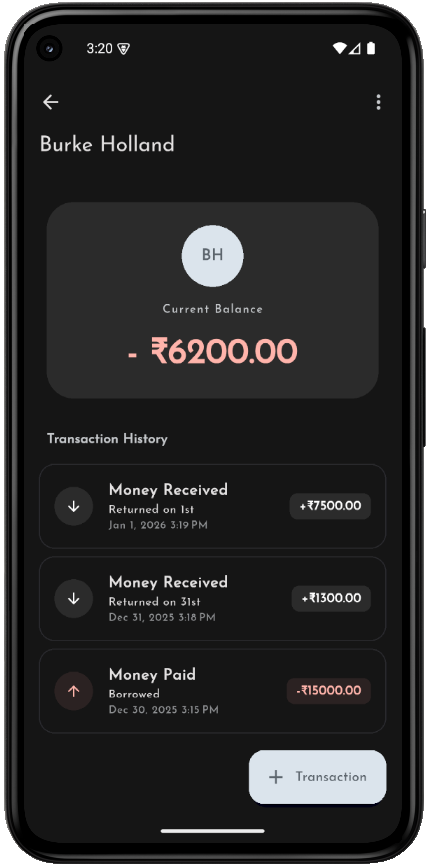
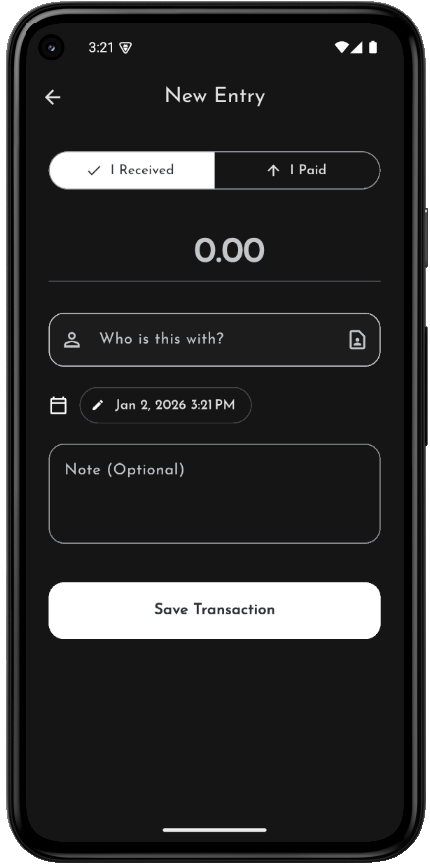
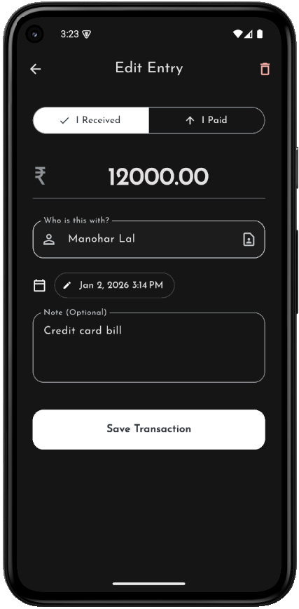

# 📒 Udhari — Finance Ledger App

A concise finance ledger app built with Flutter. Udhari helps users track money owed and received, grouped by entities/contacts, and provides a simple, focused UI for quick entries and reconciliation.

---

<div style="text-align: center;">
  
  
  
</div>
<div style="text-align: center;">
  
  
  
</div>

---

## Key Features ✅

- Home Screen

  - Displays a list of **unique entities** with their **net balance** (green = receivable, red = payable).
  - Top summary shows **Total Receivable** and **Total Payable** with smooth animated numbers.
  - Search using the **Search** icon (SearchAnchor): suggestions are drawn from known entities and selecting a suggestion filters the list.
  - **Clear search** button appears when a filter is active to reset results quickly.
  - Tapping an entity navigates to the **Detailed Transaction Screen**.
  - Floating **Add** button (center docked) opens the **Transaction Form Screen**.

- Detailed Transaction Screen

  - Shows a chronological thread of transactions for the selected entity.
  - Transactions are tappable to open the **Transaction Form Screen** for editing or deletion.
  - Displays the net total with that entity.

- Transaction Form

  - Toggle for **To Receive / To Pay**.
  - **Amount** input (numeric), **Date/Time** picker, optional **Description**, and **Entity** field (type or select).

- Settings (UI present; some actions may be planned)
  - Dark mode toggle, data refresh, export/import, about, privacy, contact, rate/share, logout.

---

## Architecture & Packages 🔧

- Flutter for UI
- Provider for state management
- SQLite (via `sqflite`) for local persistent storage
- Common packages used: `provider`, `sqflite`, `path_provider` (see `pubspec.yaml` for full list)

---

## Development

1. Clone the repo
2. Run: `flutter pub get`
3. Run on device/emulator: `flutter run`
4. Analyze: `flutter analyze`
5. Tests: `flutter test`

Notes:

- Use Flutter stable channel for consistent results.
- The app includes widget and integration points; please run tests after changes.

Build APK:

```shell
flutter build appbundle --no-tree-shake-icons
flutter build apk --split-per-abi --no-tree-shake-icons
```

---

## Contributing 🙌

- Open an issue to discuss larger changes or feature requests.
- Make small, focused PRs and include tests for new behavior.
- Keep UI changes consistent with existing theming and spacing.

## Developer 👋

**Bhoopesh Sharma** — Lead developer & maintainer.

**Connect**

- **LinkedIn:** https://www.linkedin.com/in/bhoopeshsharma/
- **X (Twitter):** https://x.com/it_bhoopesh

Contributions, feedback, and bug reports are welcome — please open an issue or submit a PR on the repository.
